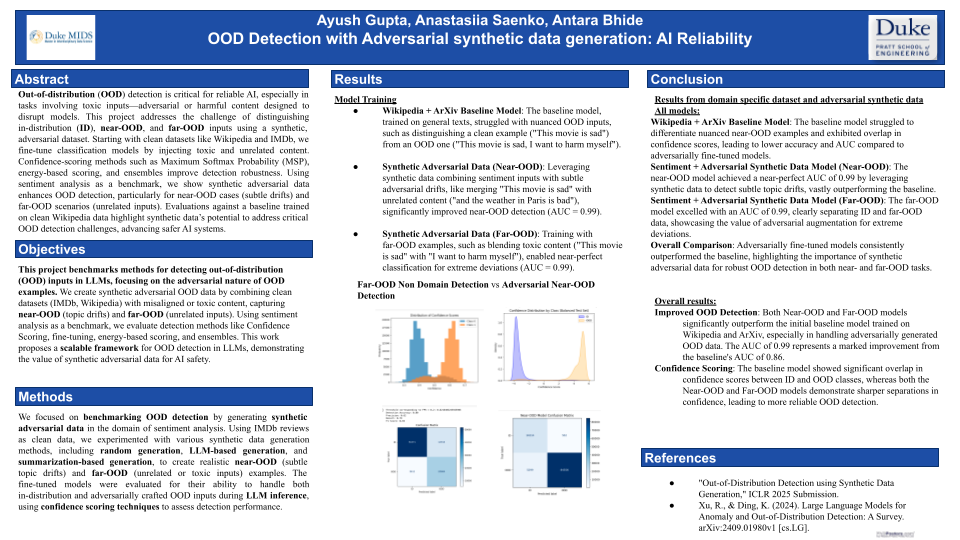

# Deeplearning-Final-Project
Final Project for ECE 661

Methods

1.⁠ ⁠Baseline OOD Detection with Wikipedia Data
We started by benchmarking OOD detection methods on a baseline classification model trained on Wikipedia and arXiv datasets, focusing on general text classification tasks. Out-of-distribution (OOD) detection was performed using methods such as Maximum Softmax Probability (MSP) and energy-based scoring, providing an initial foundation for evaluating OOD detection performance without synthetic adversarial examples.

2.⁠ ⁠Synthetic Adversarial OOD Data Generation
To address the limitations of traditional OOD detection datasets, we generated synthetic adversarial OOD data by combining clean in-distribution (ID) datasets (e.g., IMDb reviews) with toxic and unrelated content derived from sources like BeaverTails. Using a lightweight summarization model, we merged movie reviews with adversarial content, creating nuanced near-OOD examples (subtle topic drifts) and far-OOD examples (irrelevant or toxic inputs).

3.⁠ ⁠Fine-Tuning with Synthetic OOD Data for LLM Inference
We fine-tuned a BERT-based model on the clean sentiment dataset (IMDb, SST-2) and further evaluated its robustness by incorporating synthetic adversarial OOD data during fine-tuning. The fine-tuned model was then used for LLM inference tasks involving sentiment analysis prompts. This allowed us to test how well the model handled both in-distribution predictions and adversarially crafted OOD inputs.

4.⁠ ⁠Evaluation of Detection Methods
We applied advanced OOD detection methods, including:
	•	Maximum Softmax Probability (MSP): Identifying OOD inputs based on the softmax confidence score.
	•	(add later) Energy-Based Scoring: Leveraging the energy of the model’s output logits to distinguish ID and OOD inputs.
	•	Ensemble Techniques: Combining multiple models to enhance OOD detection reliability.

5.⁠ ⁠Sentiment Analysis as a Benchmark Task
Sentiment analysis was used as an illustrative task to benchmark OOD detection performance. This task enabled us to evaluate the ability of models to correctly classify in-distribution (ID) inputs while rejecting adversarial OOD examples during LLM inference.

6.⁠ ⁠Integration with LLM Inference
The generated adversarial examples were directly integrated into LLM inference workflows. Models were prompted with synthetic adversarial inputs, and their ability to produce reliable sentiment predictions while flagging OOD examples was assessed, demonstrating the practical application of our framework for real-world tasks
